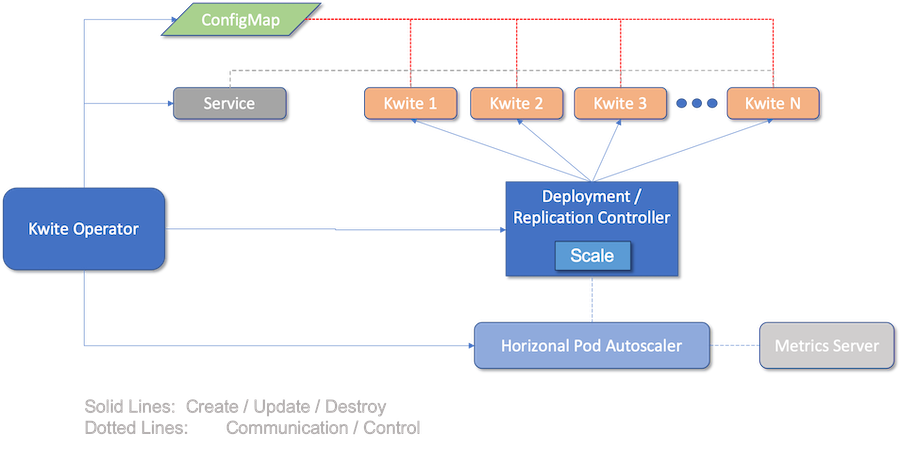

# Kwite-operator

## Overview
Kwite-operator is a [Kubernetes operator
pattern](https://kubernetes.io/docs/concepts/extend-kubernetes/operator/)
implementation for managing
[Kwites](https://github.com/tdhite/kwite). The project uses the
[Kubebuilder](https://github.com/kubernetes-sigs/kubebuilder) framework, so
understanding that particular operator framework is a good idea before really
digging in to the code herein. A good way to learn that is by reviewing the
[Kubebuiler book](https://book.kubebuilder.io).

Kwite-operator creates resources from a [Kwite
manifest](config/samples/web_v1beta1_kwite.yaml). From such manifests,
Kwite-operator creates a setup as depicted below with resource names consistent
with the Kwite name as specified in the manifest.

The [Service](https://kubernetes.io/docs/concepts/services-networking/service/)
object provides appropriate access point for any Kwites created by the
[Replication
Controller](https://kubernetes.io/docs/concepts/workloads/controllers/replicationcontroller/)
inherent to the
[Deployment](https://kubernetes.io/docs/concepts/workloads/controllers/deployment/).
Scaling is managed by the [Horizontal Pod
Autoscaler](https://kubernetes.io/docs/tasks/run-application/horizontal-pod-autoscale/).

Kwite manifests contain the [Go
templates](https://blog.gopheracademy.com/advent-2017/using-go-templates/) that
back the URL (page) served by the Kwite. Those templates are used to create a
ConfigMap, which is mounted into
[Kwite](https://github.com/tdhite/kwite) pods.

For details on Kwite customer resource manifests, see
[docs/manifest.md](docs/manifest.md).

## Try it out
To try out the operator, it must be built and executed in a suitable
[Kubernetes](https://kubernetes.io) environment. Details are [further
below](#build-and-run).

### Prerequisites
There are some basic requirements in order build and use the operator:

1. A Kubernetes cluster sufficient to run the operator and the resources it
   creates;
1. A [metrics-server](https://github.com/kubernetes-sigs/metrics-server) or
   similar to support the [Horizontal Pod Autoscaler](https://kubernetes.io/docs/tasks/run-application/horizontal-pod-autoscale/)
   created by the controller for Kwite scaling;
1. A container registry, such as [Harbor](https://goharbor.io) and relevant
   credentials for pushing and pulling containers;
1. A [Concourse](https://concourse-ci.org) or similar setup, for example
   [Argo CD](https://argoproj.github.io/argo-cd/), in order to run tests, build
   and deploy the operator.

### Kubernetes Cluster
Running the operator targets a Kubernetes cluster, thus one must exist into
which Kwite-operator deploys. The manifests do not specify a namespace, so it
will run in the default namespace unless otherwise specified.

### Metrics Server
Kwite pods are created, ultimately, via a [Replication
Controller](https://kubernetes.io/docs/concepts/workloads/controllers/replicationcontroller/)
generated by Kwite-operator. To scale the pods, Kwite-operator creates a
[Horizontal Pod
Autoscaler](https://kubernetes.io/docs/tasks/run-application/horizontal-pod-autoscale/).
In order for that to work, a [Metrics
Server](https://github.com/kubernetes-sigs/metrics-server) is a necessary
cluster resource.

NOTE: In many cases, when running the metrics server in
[Kind](https://kind.sigs.k8s.io), be mindful of [TLS
issues](https://github.com/kubernetes-sigs/metrics-server/issues/307#issuecomment-530398120).
You may need to modify the [deployment
manifest](https://github.com/kubernetes-sigs/metrics-server/blob/master/deploy/1.8%2B/metrics-server-deployment.yaml#L33-L35)
in order to get the metrics data flowing properly.

### Container Registry
In addition, as with any Kubernetes cluster, credentials should be setup.
Secrets for pushing and pulling containers from the Docker registry should
exist before building Kwite-operator. One way to add such credentials is as
follows:

    kubectl create secret docker-registry kwiteop-registry-creds --docker-server=<your-registry-server> --docker-username=<your-name> --docker-password=<your-pword> --docker-email=<your-email>

### Build and Run
Building the code involves very few steps and there are some CI/CD options to
help out.

This project includes pipeline and related task declarations in the [ci](ci)
directory. Those can be used assuming Concourse is available. See the
[ci/README](ci/README.md) file for details. Adapt those as needed for your
own CI/CD setup.

#### Run In-Cluster
So long as the pipeline runs successfully, the operator gets deployed
automatically into the Kubernetes cluster specified in the pipeline setup. No
other action is necessary, you can simply begin to deploy Kwites. For example,
the following command would deploy the sample manifest provided in this
project:

    kubectl -n some-kwite-namespace create -f config/samples

#### Running Standalone
The operator will run standalone for testing. To do that just run:

    make install

Running standalone has certain requirements regarding certificate availability
for the
[webhooks](https://kubernetes.io/docs/reference/access-authn-authz/admission-controllers/).
A good read of [Kubebuilder
deployments](https://kubebuilder.io/cronjob-tutorial/running.html) would be
valuable before attempting this.

## Contributing

The Kwite-operator project team welcomes contributions from the community.
Before you start working with Kwite-operator, please read our [Developer
Certificate of Origin](https://cla.vmware.com/dco). All contributions to this
repository must be signed as described on that page. Your signature certifies
that you wrote the patch or have the right to pass it on as an open-source
patch. For more detailed information, refer to
[CONTRIBUTING.md](CONTRIBUTING.md).

## License
Copyright: Copyright (c) 2019-2020 VMware, Inc.

SPDX-License-Identifier: [https://spdx.org/licenses/MIT.html](https://spdx.org/licenses/MIT.html)
